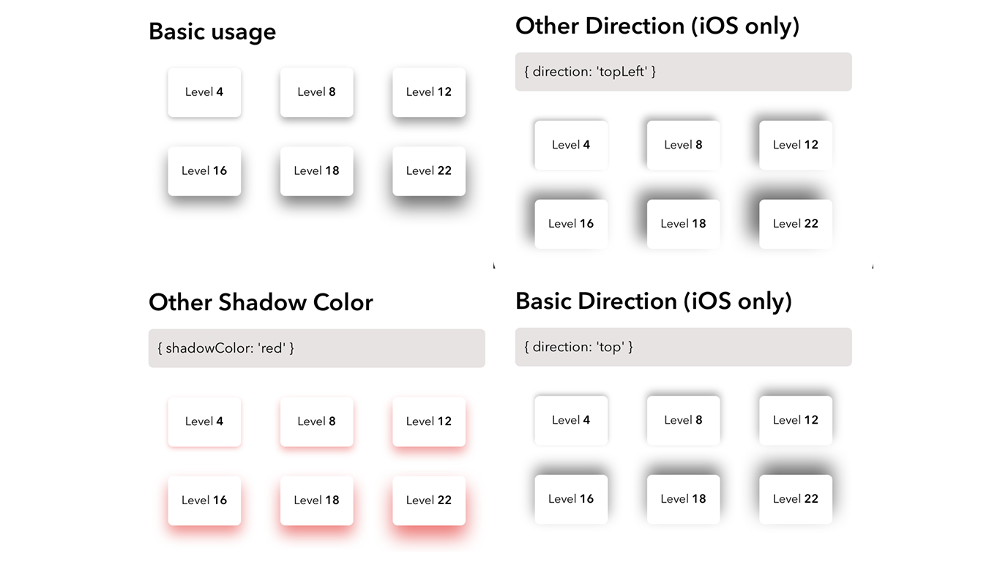

<div align="center">
  
</div>
<h1 align="center">
  @dotmind/rn-shadow-generator
</h1>
<p align="center">
  React Native Shadow Generator to quickly generate shadow of your components. Builded by <a href="https://dotmind.io/" target="_blank">.mind.io</a>
</p>
<p align="center">
  <a href="https://codecov.io/gh/dotmind/rn-shadow-generator">
    
  </a>
</p>



## Menu

* [🚀  Roadmap](#-roadmap)
* [💻  Installation](#️-installation)
* [👷‍♂️  How it's work](#️-how-its-work)
* [⚡️  Contributing](#-contributing)
* [🔐  Licence](#-contributing)

## 🚀 Roadmap

* [ ] Android full compatibility (direction support)
* [ ] Pressable component animated

## 💻 Installation

```bash
yarn add @dotmind/rn-shadow-generator
```

or

```bash
npm i @dotmind/rn-shadow-generator --save
```

## 👷‍♂️ How it's work

### ShadowView usage

```javascript
import { ShadowView } from '@dotmind/rn-shadow-generator';

const BasicComponent = () => {
  return (
    <ShadowView>
      <Text>My Shadow View</Text>
    </ShadowView>
  );
}

const MyCustomComponent = () => {
  return (
    <ShadowView level={4} shadowColor={'#000'} direction={'bottom'}>
      <Text>My Shadow View</Text>
    </ShadowView>
  );
}
```

| props | description | required | default value |
|-|-|-|-|
| level | Increase shadow dimensions | false | 4 |
| shadowColor | Change shadowColor style attribute | false | #000 |
| direction | Change shadow direction | false | bottom |

### generateShadow usage

Returns a full shadow object depending on OS (iOS or Android).

```javascript
import { generateShadow } from '@dotmind/rn-shadow-generator';

const BasicComponent = () => {
  return (
    <View style={{ ...generateShadow() }}>
      <Text>My Shadow View</Text>
    </View>
  );
}

const MyCustomComponent = () => {
  return (
    <View style={{ ...generateShadow({ level: 4, shadowColor: '#000', direction: 'bottom' }) }}>
      <Text>My Shadow View</Text>
    </View>
  );
}
```

| parameters | description | required | default value |
|-|-|-|-|
| level | Increase shadow dimensions | false | 4 |
| shadowColor | Change shadowColor style attribute | false | #000 |
| direction | Change shadow direction | false | bottom |

**Object returned**

```javascript
{
  ...Platform.select({
    ios: {
      shadowColor,
      shadowOffset,
      shadowOpacity,
      shadowRadius,
    },
    android: {
      shadowColor,
      elevation: level,
    },
  }),
}
```

## ⚡️ Contributing

Pull requests are welcome. For major changes, please open an issue first to discuss what you would like to change.

Please make sure to update tests as appropriate.

## 🔐 License

[MIT](https://choosealicense.com/licenses/mit/)
